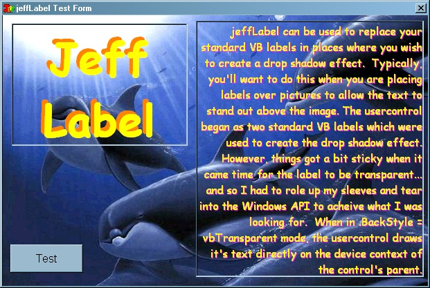

<div align="center">

## jeffLabel \- true transparent label control with drop shadow effect


</div>

### Description

jeffLabel is a replacement usercontrol for the standard Visual Basic label control. The control started out simply as a usercontrol containing two labels (for creating a simple drop shadow effect). Things got a bit more involved when it came time for the new label to be a transparent label. The solution was, while in transparent backstyle mode, for the label shadow and text to be drawn directly onto the device context of the parent control. While in transparent mode, this label demonstrates advanced usage of the DrawText API call, specifically, drawing text in any font regardless of the current font in the device context. Additionally, the GetTextFace, GetTextMetrics, GetTextColor, SetTextColor, SelectObject, and CreatFontIndirect functions are demonstrated for converting standard vb font objects into logical fonts, and device context font metrics into standard vb font objects. This is version .1 of this control, so there are some bugs I am aware of already including: transparent user controls have no .hWnd and so do not capture mouse and keyboard events (will need to subclass the parent to trap these events), when in .AutoSize mode (as the test project will demonstrate) the control has a curious effect of growing when the .Caption value is repeatedly changed (this is most likely related to my use of the standard VB controls to do the initial text sizing; this method will need to be dropped in version 1). However, despite these current bugs, if you've been looking for a label with built in drop shadow effect, or you've been trying to figure out how to create genuine transparent usercontrols in vb, this project should sufficiently jump start you on your way. =)

Not many examples can be found on Planet Source Code of creating true transparent usercontrols (usercontrol.backstyle = vbTransparent), and since this certainly is still a work in progress, your comments or suggestions below would be much appreciated.
 
### More Info
 


<span>             |<span>
---                |---
**Submitted On**   |2001-07-03 06:24:06
**By**             |[TheFrogPrince](https://github.com/Planet-Source-Code/PSCIndex/blob/master/ByAuthor/thefrogprince.md)
**Level**          |Advanced
**User Rating**    |4.3 (30 globes from 7 users)
**Compatibility**  |VB 5\.0, VB 6\.0
**Category**       |[Custom Controls/ Forms/  Menus](https://github.com/Planet-Source-Code/PSCIndex/blob/master/ByCategory/custom-controls-forms-menus__1-4.md)
**World**          |[Visual Basic](https://github.com/Planet-Source-Code/PSCIndex/blob/master/ByWorld/visual-basic.md)
**Archive File**   |[jeffLabel 22134732001\.zip](https://github.com/Planet-Source-Code/thefrogprince-jefflabel-true-transparent-label-control-with-drop-shadow-effect__1-24680/archive/master.zip)

### API Declarations

```
Private Declare Function GetTextFace _
        Lib "gdi32" _
        Alias "GetTextFaceA" ( _
       ByVal hdc As Long, _
       ByVal nCount As Long, _
       ByVal lpFacename As String) _
      As Long
Private Declare Function GetTextMetrics _
        Lib "gdi32" _
        Alias "GetTextMetricsA" ( _
       ByVal hdc As Long, _
       lpMetrics As TEXTMETRIC) _
      As Long
Private Declare Function GetDeviceCaps _
        Lib "gdi32" ( _
       ByVal hdc As Long, _
       ByVal nIndex As Long) _
      As Long
Private Declare Function MulDiv _
        Lib "kernel32" ( _
       ByVal nNumber As Long, _
       ByVal nNumerator As Long, _
       ByVal nDenominator As Long) _
      As Long
Private Declare Function SelectObject _
        Lib "gdi32" ( _
       ByVal hdc As Long, _
       ByVal hObject As Long) _
      As Long
Private Declare Function CreateFontIndirect _
        Lib "gdi32" _
        Alias "CreateFontIndirectA" ( _
       lpLogFont As LOGFONT) _
      As Long
Private Declare Function SetTextColor _
        Lib "gdi32" ( _
       ByVal hdc As Long, _
       ByVal crColor As Long) _
      As Long
Private Declare Function GetTextColor _
        Lib "gdi32" ( _
       ByVal hdc As Long) _
      As Long
Private Declare Function DrawText _
        Lib "user32" _
        Alias "DrawTextA" ( _
       ByVal hdc As Long, _
       ByVal lpStr As String, _
       ByVal nCount As Long, _
       lpRect As Rect, _
       ByVal wFormat As Long) _
      As Long
Private Declare Function GetDesktopWindow _
        Lib "user32" () _
      As Long
Private Declare Function ShellExecute _
         Lib "Shell32.dll" _
         Alias "ShellExecuteA" ( _
        ByVal hWnd As Long, _
        ByVal lpOperation As String, _
        ByVal lpFile As String, _
        ByVal lpParameters As String, _
        ByVal lpDirectory As String, _
        ByVal nShowCmd As enumShowWindow) _
       As Long
```


